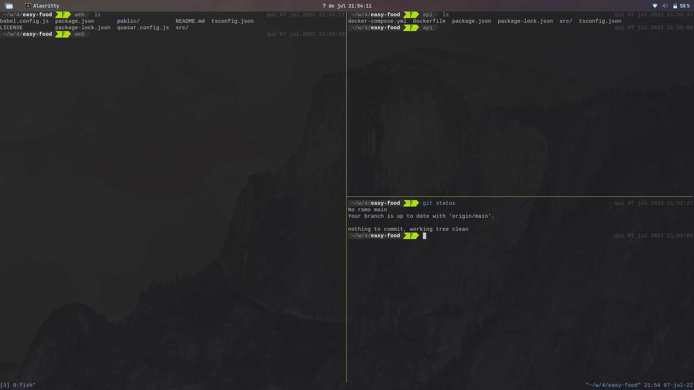

# dotfiles
Minhas configurações das ferramentas que utilizo no meu fluxo de trabalho

# Ferramentas

[neovim](https://github.com/neovim/neovim)

[alacritty](https://github.com/alacritty/alacritty)

[fish-shell](https://github.com/fish-shell/fish-shell)

[tmux](https://github.com/tmux/tmux)
